<h1>Section 17- ES2015 Part 2</h1>

<a href="http://webdev.slides.com/eschoppik/es2015-part-2-14#/">Section slides</a>

<h3>Notes:</h3>
<ul>
    <li>
        <h4><code>class</code> Keyword</h4>
        
<a href="https://developer.mozilla.org/en-US/docs/Web/JavaScript/Reference/Classes">Classes MDN Doc</a>

        <ul>
            <li>A new reserved keyword provided by ES2015</li>
            <li>The class keyword creates a constant - can not be redeclared</li>
            <li>The <code>class</code> keyword is an abstraction of constructor functions and prototypes because Javascript does not have OOP</li>
            <li><code>class</code> does not hoist - declare classes at the top of the file</li>
            <li>Still use the <code>new</code> keyword to create objects</li>
        </ul>
        <blockquote>
            <h4>In ES5 here is how we create objects:<h4/>
            
        </blockquote>
        <ul>
            <li>1st create a constructor function</li>
            <li>use <code>new</code> to create new objects</li>
        </ul>
        <blockquote>
            <h4>ES2015 version:</h4>    
            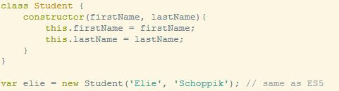
        </blockquote>    
            <ul>
                <li>use the class keyword instead of creating a function</li>
                <li>inside, use a special method constructor which is run when new is used</li>
                <li>use the new keyword to create objects</li>
            </ul>
        <ul>
            <li>in ES5, shared methods are put in the constructor's prototype:
                <blockquote>
                    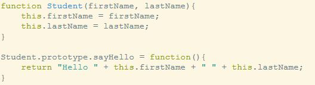
                </blockquote>
            </li>
            <li>
                <h4>Instance Methods</h4>
                in ES2015 the methods are placed inside of the <code>class</code>, and it uses no <code>function </code> keyword, similar to object shorthand
                <blockquote>
                    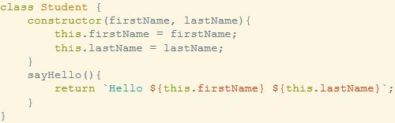
                </blockquote>
            </li>
            <li>
                <h4>Class methods</h4>
                <blockquote>
                    <h5>ES5 Class Methods</h5>
                    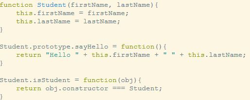
                    <ul>
                        <li>Class methods are placed directly on the constructor function</li>
                    </ul>
                </blockquote>
                <blockquote>
                    <h5>ES2015 Class Methods</h5>
                    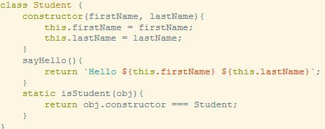
                    <ul>
                        <li>Class methods are created using <code>static</code> keyword</li>
                    </ul>
                </blockquote>
            </li>
        </ul>
    </li>
    <li>
        <h4>Inheritance</h4>
        
Passing along methods and properties from one class to another

        <blockquote>
            <h5>ES5 Inheritance</h5>
            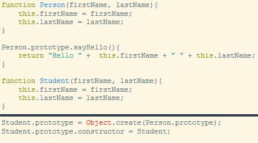
            <ul>
                <li>Set the prototype property of a constructor to be an object created from another prototype property</li>
                <li>Reset the constructor property on a constructor function</li>
            </ul>
        </blockquote>
        <blockquote>
            <h5>ES2015 inheritance</h5>
            
use the <code>extends</code> keyword

            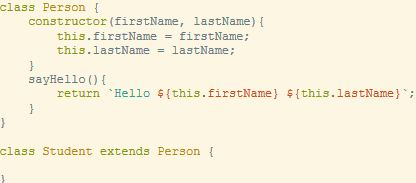
        </blockquote>
    </li>
    <li>
        <h4><code>super</code> keyword</h4>
        <blockquote>
            <h5>ES5 Refactoring constructors</h5>
            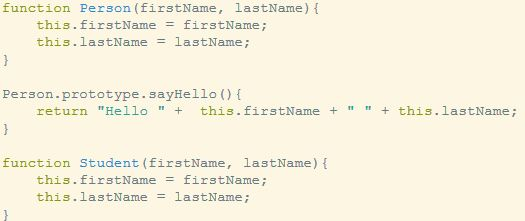
            <ul>
                <li>Notice the duplication in the Student constructor function!</li>
            </ul>
            <h5>Use <code>apply</code></h5>
            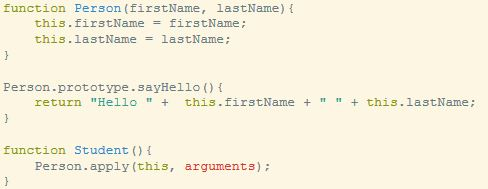
            <ul>
                <li>Use <code>call</code> or <code>apply</code> in a constructor function - <code>apply</code> is handy when there are many arguments</li>
            </ul>
        </blockquote>
        <blockquote>
            <h5>ES2015 Super</h5>
            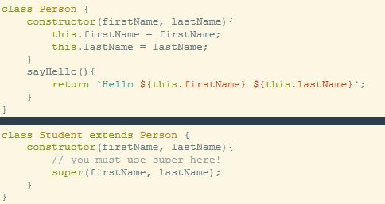
            <ul>
                <li>Super can only be used if a method by the same name is implemented in the parent class</li>
            </ul>
        </blockquote>
    </li>
</ul>
<ul>
    <li>
        <h4>Maps</h4>
        
<a href="https://developer.mozilla.org/en-US/docs/Web/JavaScript/Reference/Global_Objects/Map">Maps MDN doc</a>

        
<a href="https://hackernoon.com/what-you-should-know-about-es6-maps-dc66af6b9a1e">What you should know about ES6 Maps - Hackernoon</a>

        <ul>
            <li>Also called "hash maps" in other languages</li>
            <li>Until ES2015 - objects were replacements for maps</li>
            <li>Similar to objects, except the keys can be ANY data type!</li>
            <li>Created using the <code>new</code> keyword</li>
        </ul>
        <blockquote>
            <h5>Setting values</h5>
              
            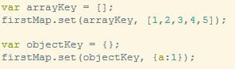
            <h5>Extracting values</h5>
            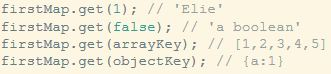
            <h5>Easily iterate over maps</h5>
            
        </blockquote>
        <blockquote>
            <h5>Maps implement a Symbol.iterator w/c means we can use a for...of loop</h5>
            
        </blockquote>
        <blockquote>
            <h5>Accessing keys and values in map</h5>
            
we can access everything with <code>.entries()</code> and destructuring!

            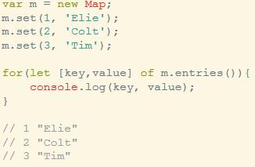
        </blockquote>
        <h4>Why Use Maps?</h4>
        <ul>
            <li>Finding the size is easy  - no more loops or <code>Object.keys()</code></li>
            <li>The keys can be any data type!</li>
            <li>You can accidentally overwrite keys on the Object.prototype in an object you make - maps do not have that issue</li>
            <li>Iterating over keys and values in a map is quite easy as well</li>
        </ul>
        <h4>When to use Map</h4>
        <ul>
            <li>If you need to look up keys dynamically (they are not hard coded strings)</li>
            <li>If you need keys that are not strings!</li>
            <li>If you are frequently adding and removing key/value pairs</li>
            <li>Are key-value pairs frequently added or removed?</li>
            <li>If you are operating on multiple keys at a time</li>
        </ul>
    </li>
    <li>
        <h4>WeakMap</h4>
        
<a href="https://developer.mozilla.org/en-US/docs/Web/JavaScript/Reference/Global_Objects/WeakMap">MDN Doc</a>

        <ul>
            <li>Similar to a map, but all keys MUST be objects</li>
            <li>Values in a WeakMap can be cleared from memory if there is no reference to them</li>
            <li>More performant than maps, but can not be iterated over</li>
        </ul>
    </li>
    <li>
        <h4>Sets</h4>
        
<a href="https://developer.mozilla.org/en-US/docs/Web/JavaScript/Reference/Global_Objects/Set">MDN doc</a>

        <ul>
            <li>All values in a set are unique</li>
            <li>Any type of value can exist in a set</li>
            <li>Created using the <code>new</code> keyword</li>
            <li>Exist in quite a few other languages, ES2015 finally brings them to JavaScript</li>
        </ul>
        <blockquote>
            <h5>Syntax</h5>
            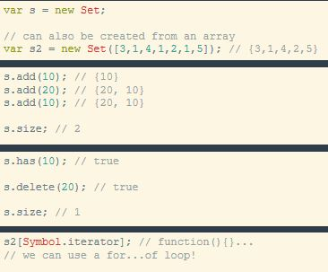
        </blockquote>
    </li>
    <li>
        <h4>Weaksets</h4>
        
<a href="https://developer.mozilla.org/en-US/docs/Web/JavaScript/Reference/Global_Objects/WeakSet">MDN doc</a>

        <ul>
            <li>Similar to a set, but all values MUST be objects</li>
            <li>Values in a WeakSet can be cleared from memory if there is no reference to them</li>
            <li>More performant than sets, but can not be iterated over</li>
        </ul>
    </li>
    <li>
        <h4>Promises</h4>
        <ul>
            <li>A one time guaranteed return of some future value</li>
            <li>When that value is figured out - the promise is resolved/fulfilled or rejected</li>
            <li>Friendly way to refactor callback code</li>
            <li>Libraries have implemented Promises for a while, ES2015 is a little late to the game</li>
        </ul>
        <h4><code>Promise.all</code></h4>
        <ul>
            <li>Accepts an array of promises and resolves all of them or rejects once a single one of the promises has been first rejected (fail fast).</li>
            <li>If all of the passed-in promises fulfill, Promise.all is fulfilled with an array of the values from the passed-in promises, in the same order as the promises passed in.</li>
            <li>You may have seen something like this when $.when in jQuery or Q</li>
            <li>The promises don't resolve sequentially, but Promise.all waits for them</li>
        </ul>
        <blockquote>
            
        </blockquote>
    </li>
</ul>