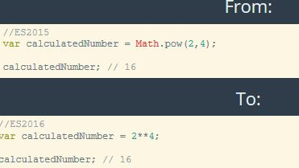
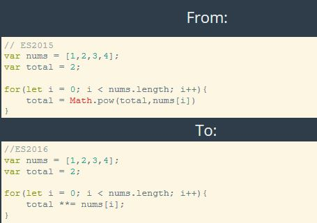
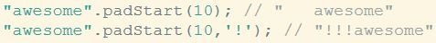
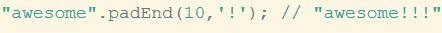
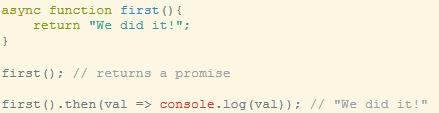

<h1>Section 18- ES2016 and ES2017</h1>

<a href="http://webdev.slides.com/eschoppik/es2015-part-2-14#/55">Section slides</a>

<h2>ES2016 new features:</h2>
<ul>
    <li>
        <h3>Exponentiation Operator <code>**</code></h3>
        <blockquote>
            <h5>Example:</h5>
            
            <h5>Another example:</h5>
            
        </blockquote>        
    </li>
    <li>
        <h3><code>[].includes</code></h3>
        <blockquote>
            
        </blockquote>
    </li>
</ul>
<h2>ES2017 new features</h2>
<ul>
    <li>
        <h3>padStart</h3>
        
<a href="https://www.theregister.co.uk/2016/03/23/npm_left_pad_chaos/">The LeftPad (padStart) Debacle</a>

        <ul>
            <li>The first parameter is the total length of the new string</li>
            <li>The second parameter is what to pad with from the start. The default is an empty space</li>
        </ul>
        <blockquote>
            
        </blockquote>
    </li>
    <li>
        <h3>padEnd</h3>
        <ul>
            <li>The first parameter is the total length of the new string</li>
            <li>The second parameter is what to pad with from the end. The default is an empty space</li>
            <blockquote>
                
            </blockquote>
        </ul>
    </li>
    <li>
        <h3>ES2017 Async Functions</h3>
        <ul>
            <li>A special kind of function that is created using the word <code>async</code></li>
            <li>The purpose of async functions is to simplify writing asynchronous code, specifically Promises.</li>
             
            
             
            <li>What makes them really special is the <code>await</code> keyword!</li>
        </ul>
    </li>
</ul>
