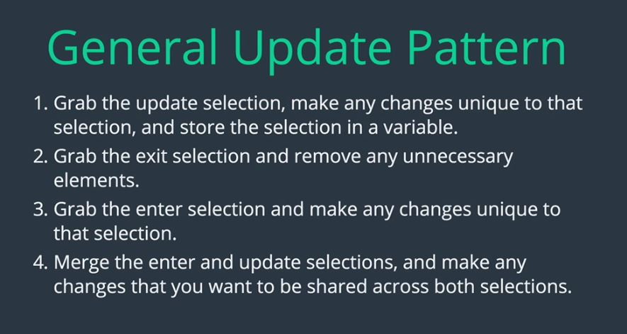

<h1>Section20- Data Joins and Update Patterns in D3</h1>

<a href="https://bost.ocks.org/mike/join/">Thinking With Joins</a>

<h3>General Update Pattern:</h3>

<h3>Supplemental Resources</h3>
<ul>
    <li><a href="https://ils.unc.edu/~gotz/D3joins/">A Guide to D3's Datajoins - UNC.edu</a></li>
    <li><a href="http://rajapradhan.com/">D3.js V4 Essentials</a></li>
</ul>